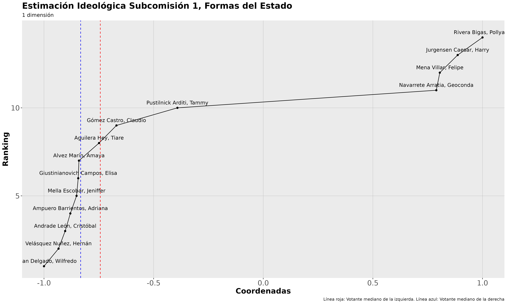
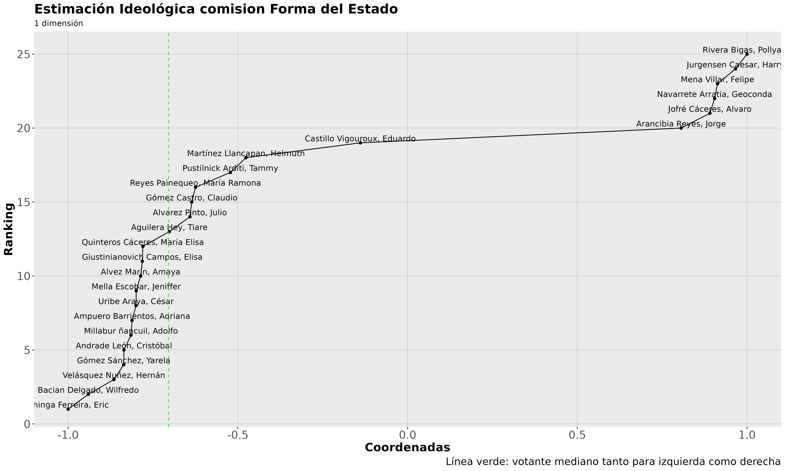

```{r setup, include=FALSE}
knitr::opts_chunk$set(echo = FALSE, message = FALSE, warning = FALSE, results = 'asis')
```

```{r}
library(tidyverse)
library(kableExtra)
```

```{=html}
<style>
body {
text-align: justify;
font-size: 14pt}
</style>
```
## **Introducción**

<br>

En el siguiente trabajo de analizará el desempeño que tuvo la comisión "forma del Estado" dentro de la convención constitucional. Sabemos que la convención tenía pocas reglas y tuvo que conformarse desde el primer día con intensos procesos de deliberación y votación entre los consituyentes, los cuales ocuparon una parte importante en la construcción de la estructura organizacional. Sus principales mecanismos fue el de construcción de comisiones con regla de voto por mayoría simple y votación en pleno bajo votación de 2/3.

<br>

## **Propuesta de análisis y métodos**

Para observar si la comisión tuvo efecto en imponer su vision en el pleno de la convencion, primero observaremos la composicion ideologica de la comision en general y de las subcomisiones en particular. luego de ello analizaremos la composicion ideologica del pleno y observadremos las diferencias entre la posicion ideologica del votante medio y pivotal, respectivamente.

Luego se realizará un análisis del éxito de la comisión en base a las votaciones a favor en el pleno.

Para esto usaremos el lenguaje de programación R, en particular el paquete ```anonimate``` para la estimación ideológica en base a los votos de cada convencional, tanto en la comisión como en el pleno.

<br>

### **Análisis de la comisión "Forma del Estado"**

La comisión "formas del Estado" está compuesta por dos subcomisiones, en las cuales se trataron cuestiones como descentralización, división política, autonomía territoriales, justicia territorial, gobierno local, modernización del estado, democratización del poder, etc. La composición de cada una de las dos subcomisiones está expuesta a continuaciòn:

<br>

#### **Lista de constituyentes de subcomisión 1:**

| Constituyente         | Lista                        |
|-----------------------|------------------------------|
| Tiare Aguilera        | Pueblos Originarios          |
| Amaya Alvez           | Apruebo Dignidad             |
| Adriana Ampuero       | Otros                        |
| Cristobal Andrade     | Lista del Pueblo             |
| Wilfredo Bacian       | PP.OO                        |
| Elisa Giustinianovich | Mov. Sociales Constituyentes |
| Claudio Gómez Castro  | Lista del Apruebo            |
| Harry Jürguensen      | Vamos Chile                  |
| Jeniffer Mella        | Apruebo Dignidad             |
| Felipe Mena           | Vamos Chile                  |
| Geoconda Navarrete    | Vamos Chile                  |
| Tammy Pustilnick      | Independientes No Neutrales  |
| Pollyana Rivera       | Vamos Chile                  |
| Hernán Velásquez      | Apruebo Dignidad             |

<br>

#### **Lista de participantes de subcomision 2:**

| **Constituyente**     | **Lista**                    |
|-----------------------|------------------------------|
| Julio Álvarez         | Lista del Apruebo            |
| Jorge Arancibia       | Vamos Chile                  |
| Eduardo Castillo      | Lista del Apruebo            |
| Eric Chinga           | Pueblo Constituyente/ PP.OO  |
| Yarela Gómez          | Apruebo Dignidad             |
| Álvaro Jofré          | Vamos Chile                  |
| Helmuth Martínez      | Lista del Pueblo (?)         |
| Adolfo Millabur       | PP.OO                        |
| Bastian Labbé         | Mov. Sociales Constituyentes |
| María Reyes Painequeo | Lista del Apruebo            |
| César Uribe           | Lista del Pueblo             |

<br> <br>

### **Estimaciones ideológicas por comisión general y subcomisiones:**

<br>

#### **Análisis subcomisión 1**

Para el análisis de la subcomisión 1 se tomó como referencia a Harry Jürguensen, quien según las estimaciones iniciales muestra la tendencia más marcada a la derecha de las disponiubles en esta subcomisión. Al probar estimaciones con una o dos estimaciones, vemos que la estimación con una sola dimensión da cuenta de manera robusta de la diferencia entre todos los convencionales de la subcomisión.

<br>

```{r, echo=FALSE, message=FALSE,warning=FALSE, out.width="100%", fig.align='center'}

knitr::include_graphics("Results/plot_comision_1d.png")
```

<br>

Al revisar la tabla completa con todos los convencionales de la subcomisión, vemos que es bastante consistente tanto con las estimaciones generales hechas opr Jorge Fàbrega como por la agrupación ideológica que se veía a nivel cualitativo en la convención constitucional. Vemos que los opuestos principales son Wilfredo Bacian (Pueblos originarios, luego parte de la "Coordinadora Constituyente Plurinacional y Popular", creada entre ex-miembros de la lista del pueblo y Pueblos originarios) y Cristobal andráde, de La Lista del Pueblo. Por otro lado Harry Jürguensen tiene como par ideológico a Pollyana Rivera.

<br>

```{r,echo=FALSE, message=FALSE,warning=FALSE, out.width="60%", fig.align='center'}

tabla_subcom1 <-readRDS("data/Final_data/tabla_subcom1.rds")

tabla_subcom1$coord1D = cell_spec(tabla_subcom1$coord1D, color = ifelse(tabla_subcom1$coord1D < 0, "red", "blue"))

kbl(tabla_subcom1, escape = F) %>%
  kable_paper("striped", full_width = F)

```

<br>

Examinando el nuevo gráfico que marca los votantes medianos, vemos que Thiare Aguilera tiene una alta revelancia para la izquierda, ya que es el punto de corte mínimo para poder ganar las votaciones de la subcomisión. En el caso de la derecha le votante medio está dado por Amaya Alvez y Elisa Gustinianovich que tienen la misma estimación ideológica.

<br>

```{r,echo=FALSE, message=FALSE,warning=FALSE, out.width="100%", fig.align='center'}


```

<br>

A partir del gráfico podemos observar que para la izquierda le es relativamente fácil ganar cada decisión, pues están ideológicamente muy próximos todos los necesarios para ganar elecciones. No así la derecha que presenta una gran distancia ideológica incluso con sus más próximas como Tammy Pustilnik, por lo que es muy probable que ninguna o casi ningún artículo podría quedar en la propuesta que iría al pleno.

<br>

#### **Análisis subcomisión 2**

Para el análisis de la subcomisión 2 se tomó como referencia por derecha a Álvaro Jofré Cáceres, persona que según las estimaciones iniciales era el más cercano ideológicamente a Harry Jürguensen. Vemos en el gráfico de la derecha que usar una sóla dimensión en vez de dos explica con bastante exactitud la dispersión ideológica

```{r,echo=FALSE, message=FALSE,warning=FALSE, out.width="80%", fig.align='center'}

knitr::include_graphics("Results/Plot_subcom2_basic.png")

```

<br>

Si observamos cómo se reparten ideológicamente tanto en la siguiente tabla como en al gráfico con los nombres de cada uno, vemos que Eric Chinga es el más extremo por izquierda y tanto Álvaro Jofré como Joirge arancibia por derecha. La repartición ideológica es bastante consistente con las estimacones se han hecho anteriormente.

```{r, echo=FALSE, message=FALSE,warning=FALSE, out.width="60%", fig.align='center'}

tabla_subcom2 <-readRDS("data/Final_data/tabla_subcom2.rds")

tabla_subcom2$coord1D = cell_spec(tabla_subcom2$coord1D, color = ifelse(tabla_subcom2$coord1D < 0, "red", "blue"))

kbl(tabla_subcom2, escape = F) %>%
  kable_paper("striped", full_width = F)

```

<br>

```{r,echo=FALSE, message=FALSE,warning=FALSE, out.width="100%", fig.align='center'}

knitr::include_graphics("Results/Plot_Subcom2.png")

```

<br>
 
Vemos además que el votante mediano de la subcomisión 2 recaía en Julio Álvarez Pinto (PS) y que en general la dispersión ideológica si bien se mantiene fuertemente hacia la izquierda, es algo más equilibrada que la subcomisión 1, como veremos más adelante en el plano de comparación con el pleno de la convención constitucional. Además de eso, vemos que hay menos personas agrupadas a la derecha y un par màs de personas que hacen de "puentes" desde la centro-izquierda hacia la centro-derecha.

Sin embargo el panorama es relativamente similar a la subcomisión 1: por como están distribuídos los votos, sería muy fácil que los sectores de izquierda puedan instalar sus artículos con facilidad, mientras que la derecha está obligada a hacer muchos esfuerzos de acercamiento ideológico para ganar votaciones.

<br>

#### **Análisis comisión de forma general**

Al igual que en las subcomisiones, vemos que la dispersión ideológica se explica en buena medida por una sola dimensión. La dispersión ideológica general se asejema bastante a la de la subcomisión 1, donde hay una carga notora hacia la izquierda con un vacío importante en el centro.

<br>


```{r,echo=FALSE, message=FALSE,warning=FALSE, out.width="100%", fig.align='center'}

knitr::include_graphics("Results/plot_comision_1d.png")

```

<br>

```{r, echo=FALSE, message=FALSE,warning=FALSE, out.width="100%", fig.align='center'}


```

<br>

El histograma con los grados de corte muestra que gran parte de las iteraciones de las estimaciones cortan en los 90 grados, y el gráfico de líneas de corte muestra una marca hacia la izquierda pero principalmente vertical.`

```{r, echo=FALSE, message=FALSE,warning=FALSE, out.width="60%", fig.align='center'}

comision_general <-readRDS("data/Final_data/comision_general.rds")

comision_general$coord1D = cell_spec(comision_general$coord1D, color = ifelse(comision_general$coord1D < 0, "red", "blue"))

kbl(comision_general, escape = F) %>%
  kable_paper("striped", full_width = F)

```

<br>

```{r, echo=FALSE, message=FALSE,warning=FALSE, out.width="100%", fig.align='center'}



```

<br>

Al analizar el gráfico general que incluye el votante mediado, vemos que nuevamente hay una fuerte carga a la izquierda con Eric Chinga como el de ideología diametralmente opuesta a la de jürguensen, quien a su vez correlaciona fuertemente con Pollyana Rivera por derecha. Existe una gran separación ideológica donde Eduardo Castillo (PPD) se acerca un poco más hacia el centro, pero aún así con una gran diferencia.

Apoyándose en la teoría espacial del voto, vemos que en esta comisión hay una probabilidad bastante alta que los articulados e informes estén mucho más inclinados hacia la izquierda. pero, ¿Es esto representativo del pleno? Puede tener èxito en èl?

### **Análisis del pleno de la Convención Constitucional**

<br>

Para el análisis del pleno se optó por usar a Katherine Montealegre como la persona de derecha, usando las estimaciones iniciales por Fábrega, y al mismo tiempo se busca establecer un eje "liberal/conservador" con Agustín Squella como referencia liberal. Al revisar gráfico de dos dimensiones vemos que hay una buena parte explicada ya con un sólo eje (el cual profundizaremos), sin embargo vale la pena señalar que en el pleno se divide en cuatro grandes clusters: almenos tres grupos inclinados de drecha, algunos con más tendencia cercana a Squella (esquina superior izquierda) y otro grupo muy concentrado en la esquina inferior izquierda. Además vemos otro grupo fuertemente cargado a la derecha y un par de grupos más fragmentados y poco agrupados que están hacia el centro.


<br>

```{r,echo=FALSE, message=FALSE,warning=FALSE, out.width="100%", fig.align='center'}

knitr::include_graphics("Results/Plot_pleno.png")

```

<br>
<br>

El gráfico expuesto muestra la relación entre votantes pivotales de la subcomisión 1 y subcomisión 2, donde la primera es al mismo tiempo la votante pivotal de la comisión en su conjunto. Bajo la estimación ideológica que hemos hecho, vemos que Tiare Aguilera, como pivotal de la comisión, está a 42 constituyentes de distancia de el votante pivotal del pleno de la convención, representado por Pedro muñoz (PS). Diferente es el caso de al subcomisión 2 que está bastante maś cerca del votante pivotal del pleno de la convención en comparación a la subcomisión 1 y la comisión general.

Esta información indica que cuando el informe de la comisión ingrese al pleno, este va a ser constantemente rechazado ya que está creado en composiciones ideológicas muy distintas, donde la comisión tiene un pensamiento más extremo que el pleno. Es de esperar que el porcentaje de éxito sea muy bajo


a continuación analizaremos el porcentaje de éxito

### **Éxito de la comisión en votaciones del pleno**

<br>

Para analizar el éxito del pleno sobre la convención se analizazrá en tres periodios distintos: el período de evaluación del informe 1, 2 y 3, expresados en la variable "grupo". El supuesto adyacenbte es que el primer informe representa el producto más "puro" de la comisión forma de Estado, mientras que los informes 2 y 3 (grupos 2 y 3 en la tabla) representan las formas más moderadas de dicho informe, el cual involucran principalmente el análisis en particular y por inciso de cada propuesta al pleno. Lamentablemente por disponibilidad de datos y por la dinámica de votación, no podemos hacer un análisis de la votación en general por cada informe, ya que en el primer informe se pidió analizar en particular por sobre el general, y porque en el tercer informe no tenemos datos disponibles.


```{r, echo=FALSE, warning=FALSE, message=FALSE}

tabla <-readRDS("data/Final_data/tabla_votos_informe.RDS")


modelsummary::datasummary_crosstab(grupo ~ resultado, statistic = 1 ~ Percent("row"), data = tabla)


```


<br>

Observamos que el porcentaje de aprobación de todo el informe 1 es bastante mayor al que esperabamos en base a las estimaciones ideológicas, con casi un 60% de aprobación de artículos relativos a dicho informe. Sin embargo en la medida en que el trabajo de la comisión debería "moderarse", vemos que al mismo tiempo la tasa de aprobación de sus propuestas es cada vez menos, llegango a un prácticmaente 40% de de aprobación de artículos vs un 60% de rechazo de ellos, inviertiendo la proporción entre el primer y tercer informe. Al mismo tiempo la taza de abstenciónes y no votantes aumentó.


## **Conclusiones**

<br>

En conclusión y atendiendo a la consigna original, vemos que la comisión, a pesar de su ideología que estaba bastante más alejada a la del votante pivotal del pleno, pudo de todas formas imponer su visión e n un porcentaje bastante alto del total de votaciones que correspondían a dicha comisión. Una hipótesis interesante que no podemos trabajar acá es si el porcentaje de rechazo se debe pŕincipalmente a las propuestas de la subcomisión 1 en desmedro de la subcomisión 2 que era más moderada, pero los datos no están subdidividos de esta forma por lo que se tendría que convinar un análisis cualitativo de archivo para poder mejorar y robustecer la base de datos de votaciones y poder hacer la distinción.


<br>

## **Anexo**


### **Gráfico de dos dimensiones del Pleno de la convención constitucional**

```{r, out.width="100%", fig.align='center'}


```


<br>

### **Tabla completa de estimaciones ideológicas del pleno de la convención Constitucional**

```{r, echo=FALSE, results='asis'}

pleno_general <-readRDS("data/Final_data/tabla_pleno.rds")

pleno_general$coord1D = cell_spec(pleno_general$coord1D, color = ifelse(pleno_general$coord1D < 0, "red", "blue"))


kbl(pleno_general, escape = F) %>%
  kable_paper("striped", full_width = F)
#knitr::kable(pleno_general, align = "cccccc")

```
